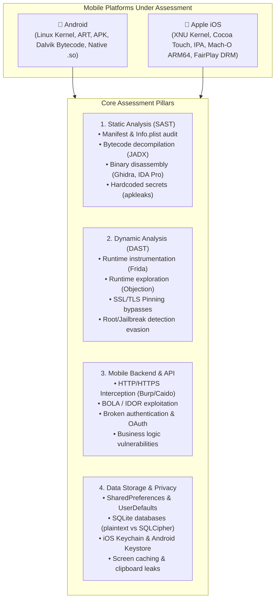

# 📱 Mobile Application Penetration Testing & Tester Roadmap

> **The definitive, hands-on, modular guide to mastering Mobile Application Penetration Testing for Android and iOS — covering architecture, reverse engineering, dynamic instrumentation, vulnerability exploitation, and professional consulting.**

---

## 🧭 Repository Guides Navigation

This section of the roadmap is divided into three comprehensive, dedicated modules:

| Guide | Target Platform / Topic | Key Focus Areas |
| :--- | :--- | :--- |
| 🤖 **[Android Penetration Testing Guide](./android/README.md)** | **Android OS (Java, Kotlin, Native C/C++)** | • APK/AAB anatomy, ART, Linux UID sandboxing • Rooting (Magisk, KernelSU), System CA certs • JADX, Apktool Smali patching, Ghidra `.so` • Frida hooks, Objection, SSL pinning bypasses • Insecure IPC, Content Providers, Deep links, APIs |
| 🍎 **[iOS Penetration Testing Guide](./ios/README.md)** | **Apple iOS (Swift, Objective-C, Mach-O)** | • App sandboxing, Secure Enclave, Keychain • Jailbreaking (Checkra1n, Palera1n, Dopamine), TrollStore • FairPlay DRM IPA decryption (frida-ios-dump, bagbak) • Class dumping, Mach-O ARM64 reversing • Frida ObjC/Swift hooking, Keychain extraction, ATS |
| 🎓 **[Becoming a Mobile Pentester: Career & Consulting](./becoming-a-mobile-pentester.md)** | **Career, Consulting & Methodologies** | • De-mythologizing pentesting (Mr. Robot vs reality) • Why "Security is NOT an Entry-Level Field" (JHalon) • Core fundamentals: Networking, OS, Programming • Consulting lifecycle (40–80h scopes, report writing) • Building an undeniable "Proof of Work" portfolio |

---

## 🗺️ High-Level Mobile Security Architecture

---

## 🌟 Featured Interactive Platforms & Training

1. **[Hextree.io](https://hextree.io)**: High-quality, modern hands-on Android security training, advanced IPC attacks, intent redirection, dynamic exploitation, and bug bounty methodologies created by LiveOverflow and Martin.
2. **[Mobile Hacking Lab](https://www.mobilehackinglab.com/)**: Enterprise-grade practical challenges across Android and iOS operating on realistic virtual and cloud Corellium devices.
3. **[Jean-François Maes (JHalon) - Becoming a Mobile Pentester](https://jhalon.github.io/becoming-a-pentester/)**: The canonical practical career advice, technical roadmap, and consulting methodology guide.
4. **[OWASP Mobile Application Security (MAS)](https://mas.owasp.org/)**:
   - **MASTG (Mobile Application Security Testing Guide)**: The authoritative 600+ page manual for testing Android and iOS apps.
   - **MASVS (Mobile Application Security Verification Standard)**: Baseline verification criteria across Storage, Crypto, Auth, Network, Platform, and Code.
5. **[PortSwigger Web Security Academy](https://portswigger.net/web-security)**: Deep-dive into REST, GraphQL, and OAuth vulnerabilities that power mobile backend APIs.

---

## 🎮 Hands-On Vulnerable Target Applications

### Android Labs
- **[AllSafe](https://github.com/t0thkr1s/allsafe)**: Modern Kotlin-based vulnerable app covering Intent redirection, deep links, native code flaws, and Smali patching.
- **[InsecureBankv2](https://github.com/dineshshetty/Android-InsecureBankv2)**: Classic vulnerable Android banking application with a Python backend.
- **[AndroGoat](https://github.com/satishpatnayak/AndroGoat)**: OWASP Top 10 vulnerabilities for Android in Kotlin.
- **[InjuredAndroid](https://github.com/B3nac/InjuredAndroid)**: CTF-style Android challenges covering SQLite, Firebase, and crypto flaws.
- **[Damn Vulnerable Bank (DVB)](https://github.com/rewanthtammana/Damn-Vulnerable-Bank)**: Practical mobile banking lab with backend API security vulnerabilities.

### iOS Labs
- **[DVIA-v2 (Damn Vulnerable iOS App)](https://github.com/prateek147/DVIA-v2)**: Swift-based vulnerable iOS application covering anti-tampering, keychain security, network interception, and runtime manipulation.
- **[OWASP iGoat-Swift](https://github.com/OWASP/iGoat-Swift)**: Official OWASP iOS learning project.

### Reverse Engineering Crackmes
- **[Crackmes.one](https://crackmes.one/)**: Filter by "Android" / "ARM" / "iOS" to practice reversing APKs, native `.so` binaries, and Mach-O executables.
- **[OWASP MASTG UnCrackable Apps](https://github.com/OWASP/mastg/tree/master/Crackmes)**: Official OWASP mobile reverse engineering challenges (Android Levels 1–4, iOS Levels 1–2).

---

## 🛠️ Cross-Platform Mobile Tooling Matrix

| Tool | Category | Target OS | Description |
| :--- | :--- | :--- | :--- |
| **[Frida](https://frida.re/)** | Dynamic Instrumentation | Android / iOS | Inject JavaScript hooks into native apps and binaries in real-time. |
| **[Objection](https://github.com/sensepost/objection)** | Runtime Exploration | Android / iOS | Frida-powered mobile security assessment without writing code. |
| **[Burp Suite](https://portswigger.net/burp)** | Interception Proxy | Android / iOS | Industry-standard web and API traffic interception and analysis. |
| **[Caido](https://caido.io/)** | Interception Proxy | Android / iOS | Lightweight, fast Rust-based security proxy. |
| **[MobSF](https://github.com/MobSF/Mobile-Security-Framework-MobSF)** | Automated SAST/DAST | Android / iOS | Complete framework for automated static and dynamic analysis. |
| **[Ghidra](https://ghidra-sre.org/)** | Disassembler / SRE | Android / iOS | Reverse engineer native `.so` and Mach-O ARM64 binaries. |
| **[JADX](https://github.com/skylot/jadx)** | Decompiler | Android | Decompile Dalvik bytecode into readable Java/Kotlin source code. |
| **[Apktool](https://apktool.org/)** | Disassembler | Android | Decode resources, disassemble Smali, and rebuild modified APKs. |
| **[apkleaks](https://github.com/dwisiswant0/apkleaks)** | Secret Scanner | Android | Scan APK files for URIs, endpoints, and credentials. |
| **[frida-ios-dump](https://github.com/AloneMonkey/frida-ios-dump)** | DRM Decryptor | iOS | Pull decrypted IPAs directly from jailbroken iOS devices. |
| **[bagbak](https://github.com/ChiChou/bagbak)** | DRM Decryptor | iOS | Automated one-click iOS app decryptor powered by Frida. |
| **[class-dump](https://github.com/nygard/class-dump)** | Header Dumper | iOS | Extract Objective-C class declarations from Mach-O binaries. |

---

## 🏆 Mobile Security Certifications Matrix

| Certification | Provider | Format | Practical / Hands-on | Key Focus |
| :--- | :--- | :--- | :--- | :--- |
| **Certified Mobile Pentester** | [Mobile Hacking Lab](https://www.mobilehackinglab.com/certifications) | Practical Lab | 100% Practical | Enterprise Android and iOS vulnerability exploitation. |
| **eMAPT** | eLearnSecurity / INE | Practical Exam | 100% Practical | Reverse engineering and exploiting vulnerable Android applications. |
| **OSMR** | Offensive Security | 24-hr Practical | 100% Practical | macOS and iOS internals, memory corruption, and security bypasses. |
| **GIAC GMOB** | SANS / GIAC | Proctored Exam | Multiple-Choice | Mobile device architectures, network traffic, and enterprise MDM. |

---

## 🚀 Recommended Next Steps

1. **New to Mobile Pentesting?** Start by reading **[Becoming a Mobile Pentester: Career & Consulting](./becoming-a-mobile-pentester.md)** to understand the prerequisite fundamentals and mindset.
2. **Ready for Android?** Dive straight into the **[Android Penetration Testing Guide](./android/README.md)**.
3. **Targeting iOS?** Follow the **[iOS Penetration Testing Guide](./ios/README.md)**.
