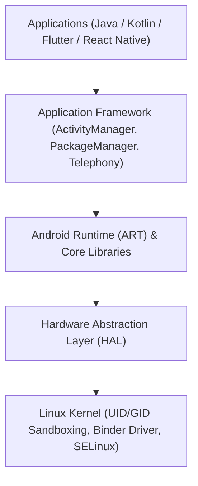

# 🤖 Comprehensive Android Application Penetration Testing Guide

> **A complete, hands-on, beginner-to-advanced roadmap for auditing, reverse engineering, dynamically instrumenting, and exploiting Android applications.**

---

## 📋 Table of Contents

- [1. Android Architecture & Security Model](#1-android-architecture--security-model)
  - [Linux Kernel & Sandboxing](#linux-kernel--sandboxing)
  - [ART vs Dalvik Runtime](#art-vs-dalvik-runtime)
  - [APK & AAB Anatomy](#apk--aab-anatomy)
  - [Signature Schemes (v1–v4)](#signature-schemes-v1v4)
  - [Android IPC Mechanism & Binder](#android-ipc-mechanism--binder)
  - [Core Components Anatomy](#core-components-anatomy)
- [2. Testing Environment & Lab Setup](#2-testing-environment--lab-setup)
  - [Physical Devices vs Emulators](#physical-devices-vs-emulators)
  - [Rooting with Magisk, KernelSU, and APatch](#rooting-with-magisk-kernelsu-and-apatch)
  - [Essential ADB Commands](#essential-adb-commands)
  - [System CA Certificate Installation (Android 7+ & Android 14+ APEX)](#system-ca-certificate-installation)
  - [Configuring Interception Proxies (Burp Suite & Caido)](#configuring-interception-proxies)
- [3. Static Analysis & Reverse Engineering (SAST)](#3-static-analysis--reverse-engineering-sast)
  - [Decompilation with JADX-GUI & Bytecode Viewer](#decompilation-with-jadx-gui--bytecode-viewer)
  - [Smali Disassembly, Patching & Rebuilding (Apktool)](#smali-disassembly-patching--rebuilding)
  - [AndroidManifest.xml Security Audit](#androidmanifestxml-security-audit)
  - [Automated Scanning (MobSF, apkleaks, trufflehog)](#automated-scanning)
  - [Native Code Analysis in Ghidra / IDA Pro (.so libraries)](#native-code-analysis-in-ghidra--ida-pro)
- [4. Dynamic Analysis & Runtime Instrumentation (DAST)](#4-dynamic-analysis--runtime-instrumentation-dast)
  - [Dynamic Instrumentation with Frida](#dynamic-instrumentation-with-frida)
  - [Runtime Exploration with Objection](#runtime-exploration-with-objection)
  - [Bypassing SSL/TLS Pinning (Universal, OkHttp, Flutter BoringSSL)](#bypassing-ssltls-pinning)
  - [Root Detection Evasion](#root-detection-evasion)
- [5. Vulnerability Deep-Dives & Attack Scenarios](#5-vulnerability-deep-dives--attack-scenarios)
  - [Insecure IPC & Intent Redirection](#insecure-ipc--intent-redirection)
  - [Content Provider Exploitation (SQLi & Path Traversal)](#content-provider-exploitation)
  - [Deep Links & App Links Hijacking](#deep-links--app-links-hijacking)
  - [Insecure Local Storage & Cryptography Anti-Patterns](#insecure-local-storage--cryptography-anti-patterns)
  - [Insecure WebViews & JavaScript Interfaces](#insecure-webviews--javascript-interfaces)
  - [Mobile API Security (BOLA, Auth Flaws)](#mobile-api-security)
- [6. Practical Vulnerable Labs & CTFs](#6-practical-vulnerable-labs--ctfs)
- [7. Android Security Tools Matrix](#7-android-security-tools-matrix)
- [8. Step-by-Step Android Pentest Checklist](#8-step-by-step-android-pentest-checklist)

---

## 1. Android Architecture & Security Model



### Linux Kernel & Sandboxing
- **Unique UID/GID per Application**: Android assigns each application a distinct Linux User ID (e.g., `u0_a145`). Because file permissions are enforced by the Linux kernel, App A cannot read private files in `/data/data/com.app.b/` unless both apps explicitly share a UID (`android:sharedUserId`) and are signed by the same certificate.
- **SELinux (Security-Enhanced Linux)**: Enforces Mandatory Access Control (MAC). Even if a process runs as `root`, SELinux domains restrict what system calls and file paths that process can interact with.

### ART vs Dalvik Runtime
- **Dalvik**: Legacy process virtual machine (pre-Android 5.0) relying on Just-in-Time (JIT) compilation.
- **ART (Android Runtime)**: Introduced Ahead-of-Time (AOT) compilation (`dex2oat`), compiling Dalvik bytecode into native ELF machine code upon installation. Modern ART combines AOT, JIT, and profile-guided execution.

### APK & AAB Anatomy
An APK is a standard ZIP archive containing:
- `AndroidManifest.xml`: Binary XML declaring permissions, exported components, hardware features, and security flags.
- `classes.dex`: Dalvik Executable bytecode. (Large applications contain multiple: `classes.dex`, `classes2.dex`, etc.).
- `resources.arsc`: Pre-compiled binary XML resources, strings, and layout IDs.
- `res/`: Media and XML files not compiled into `resources.arsc`.
- `lib/<ABI>/`: Native compiled C/C++ libraries (`.so`) for `arm64-v8a`, `armeabi-v7a`, `x86_64`.
- `assets/`: Raw asset files (HTML/JS for WebViews, certificates, SQLite databases, ML models).
- `META-INF/`: Cryptographic signature manifests (`MANIFEST.MF`, `CERT.SF`, `CERT.RSA`).

### Signature Schemes (v1–v4)
1. **v1 (JAR signing)**: Signs only individual archive entries. Archive metadata (like zip central directory) is unverified.
2. **v2 (APK Signature Scheme v2)**: Introduced in Android 7.0. Verifies the entire APK file hash, preventing modifications to any part of the zip archive.
3. **v3 (APK Signature Scheme v3)**: Adds key rotation capabilities and proof-of-rotation records.
4. **v4 (Streaming signature)**: Optimized for fast streaming installation over ADB.

### Android IPC Mechanism & Binder
- Android components communicate across separate process sandboxes through the **Binder driver** located at `/dev/binder`.
- High-level abstractions:
  - **Intents**: Asynchronous messaging objects passing data between Activities, Services, and Broadcast Receivers.
  - **AIDL (Android Interface Definition Language)**: Defines programmatic RPC client-server interfaces over Binder.
  - **Messengers**: Lightweight reference to a Handler for cross-process messaging.

### Core Components Anatomy
- **Activity**: Single focused user interface screen.
- **Service**: Background worker without UI (e.g., audio playback, periodic polling).
- **Broadcast Receiver**: Component that listens for system-wide or app-specific broadcast announcements (e.g., `BOOT_COMPLETED`, network state changes).
- **Content Provider**: Standardized database abstraction interface for querying and modifying shared structured data.

---

## 2. Testing Environment & Lab Setup

### Physical Devices vs Emulators
- **Physical Device (Recommended)**: Google Pixel 3 through Pixel 8. Unlockable bootloader, physical ARM64 architecture, authentic hardware-backed Keystore, Bluetooth, and cellular hardware.
- **Emulators**:
  - **Android Studio AVD**: Choose images labeled **Google APIs** (NOT "Google Play Store"). Google APIs images allow running `adb root` directly.
  - **Genymotion**: Fast virtualization with pre-rooted Android virtual machines.

### Rooting with Magisk, KernelSU, and APatch
- **Magisk**: Systemless root modifying the boot image.
  - Supports **Zygisk** (modules injecting directly into the Zygote process).
  - Recommended Modules:
    - `Shamiko`: Advanced root detection evasion.
    - `MagiskTrustUserCerts`: Copies user certificates into `/system/etc/security/cacerts`.
    - `Zygisk-LSPosed`: Xposed framework for runtime hooking.
- **KernelSU & APatch**: Modern alternatives that embed root inside the Linux kernel itself. Undetectable by conventional userspace root-checking libraries like RootBeer.

### Essential ADB Commands
```bash
# Verify connection
adb devices

# Restart adb daemon with root permissions
adb root

# Access interactive shell
adb shell

# Install an APK with permission auto-grant
adb install -g target.apk

# Extract an installed APK
pm list packages -3 | grep target
pm path com.target.app
adb pull /data/app/~~.../com.target.app-.../base.apk app.apk

# Launch an activity with custom extras
adb shell am start -n com.target.app/.ui.AdminActivity --es "user_role" "admin"

# Query a Content Provider
adb shell content query --uri content://com.target.app.provider/users

# Send a Broadcast
adb shell am broadcast -a com.target.app.ACTION_UPDATE --es "status" "verified"
```

### System CA Certificate Installation

On Android 7.0+ (API 24), apps ignore user-installed certificates by default. The certificate must be pushed to the **System Trust Store** (`/system/etc/security/cacerts/`).

```bash
# 1. Export Burp CA in DER format (cacert.der)
# 2. Convert to PEM:
openssl x509 -inform DER -in cacert.der -outform PEM -out burp.pem

# 3. Calculate old subject hash:
HASH=$(openssl x509 -inform PEM -subject_hash_old -in burp.pem | head -1)

# 4. Rename to <hash>.0:
mv burp.pem ${HASH}.0

# 5. Push to Android system certificate directory:
adb root
adb remount
adb push ${HASH}.0 /system/etc/security/cacerts/
adb shell chmod 644 /system/etc/security/cacerts/${HASH}.0
adb reboot
```

> **Android 14+ Note**: Android 14 stores system certificates inside an immutable APEX module (`/apex/com.android.conscrypt/cacerts/`). Use the `MagiskTrustUserCerts` module or run a bind-mount script to overlay the APEX directory.

### Configuring Interception Proxies
1. In **Burp Suite** or **Caido**, configure Proxy Listener:
   - Specific address: Your workstation's Wi-Fi IP (e.g., `192.168.1.50`).
   - Port: `8080`.
2. On Android:
   - Wi-Fi Settings -> Select connected network -> Modify -> Proxy -> Manual.
   - Hostname: `192.168.1.50`, Port: `8080`.

---

## 3. Static Analysis & Reverse Engineering (SAST)

### Decompilation with JADX-GUI & Bytecode Viewer
- **JADX**: The gold standard for recovering readable Java/Kotlin code from DEX bytecode.
  ```bash
  jadx-gui target.apk
  ```
  - Keyboard shortcuts: `Ctrl+N` (Search class), `Ctrl+Shift+F` (Search text/strings everywhere), `R` (Find method references).
- **Bytecode Viewer**: Useful for viewing DEX, Smali, and Java side-by-side using multiple decompilers (CFR, Procyon, Fernflower).

### Smali Disassembly, Patching & Rebuilding
Smali is the human-readable assembly representation of Dalvik bytecode.
```bash
# 1. Disassemble APK into smali files
apktool d target.apk -o unpacked/

# 2. Locate and edit the target check in unpacked/smali/.../SecurityCheck.smali:
# Example: Change conditional branch `if-eqz v0, :cond_0` to `if-nez v0, :cond_0` or `goto :cond_0`

# 3. Rebuild the modified APK
apktool b unpacked/ -o patched_unaligned.apk

# 4. Align and sign the patched APK
zipalign -p -f -v 4 patched_unaligned.apk patched.apk
uber-apk-signer -a patched.apk
```

### AndroidManifest.xml Security Audit

| Attribute | Vulnerable Value | Risk & Explanation |
| :--- | :--- | :--- |
| `android:debuggable` | `"true"` | Process memory can be inspected and altered using `gdb` or `jdb` without root. |
| `android:allowBackup` | `"true"` | Private databases and preferences can be extracted via `adb backup`. |
| `android:usesCleartextTraffic` | `"true"` | Plaintext HTTP is allowed, exposing data to Wi-Fi eavesdropping. |
| `android:exported` | `"true"` | Component is accessible to all other applications on the device without permission restrictions. |

### Automated Scanning
```bash
# Secret and API endpoint discovery
apkleaks -f target.apk -o leaks.json

# Comprehensive automated SAST framework
docker run -it --rm -p 8000:8000 opensecurity/mobile-security-framework-mobsf:latest
```

### Native Code Analysis in Ghidra / IDA Pro (.so libraries)
Native C/C++ libraries reside in `lib/<arch>/libnative.so`.
- Inspect JNI function registrations:
  - **Static Registration**: Exported functions follow the naming convention `Java_com_package_class_methodName(JNIEnv *env, jobject thiz, ...)`.
  - **Dynamic Registration**: Methods are bound at runtime via `(*env)->RegisterNatives(...)` in `JNI_OnLoad`. Search for calls to `RegisterNatives` in Ghidra to find unexported native pointers.

---

## 4. Dynamic Analysis & Runtime Instrumentation (DAST)

### Dynamic Instrumentation with Frida

Frida injects Google's V8 JavaScript engine into the target application process.

#### Basic Commands:
```bash
# List running processes and package names
frida-ps -Uai

# Spawn and inject script
frida -U -f com.target.app -l hook.js --no-pause
```

#### Practical Android Hook Example (`hook.js`):
```javascript
Java.perform(function () {
    console.log("[*] Script loaded. Hooking methods...");

    // Hooking a class method
    var SecurityUtil = Java.use("com.target.app.utils.SecurityUtil");
    SecurityUtil.isRooted.implementation = function () {
        console.log("[+] Intercepted isRooted() call! Forcing return false.");
        return false;
    };

    // Inspecting arguments and return values
    var LoginActivity = Java.use("com.target.app.ui.LoginActivity");
    LoginActivity.doLogin.overload("java.lang.String", "java.lang.String").implementation = function (user, pass) {
        console.log("[*] Captured credentials -> User: " + user + " | Password: " + pass);
        return this.doLogin(user, pass); // Call original method
    };
});
```

---

### Runtime Exploration with Objection

```bash
# Attach and explore
objection -g com.target.app explore

# Objection Shell Commands:
android root disable                    # Automatic root detection bypass
android sslpinning disable              # Universal SSL Pinning bypass
android keystore list                   # Dump Keystore aliases
android hooking list activities         # List all activities
android hooking launch_activity com.target.app.AdminActivity  # Force launch activity
android hooking watch class_method com.target.app.crypto.AES.decrypt --dump-args --dump-return
```

---

### Bypassing SSL/TLS Pinning

#### Method 1: Objection
```bash
objection -g com.target.app explore -q
android sslpinning disable
```

#### Method 2: Universal Frida Script
```bash
frida -U -f com.target.app --codeshare pcipolloni/universal-android-ssl-pinning-bypass-with-frida --no-pause
```

#### Method 3: Flutter / BoringSSL Bypass
Flutter does not rely on Android's system certificates; it uses embedded BoringSSL.
Use Frida to hook the handshake verification function `ssl_crypto_x509_session_verify_cert_chain`:
```bash
frida -U -f com.target.flutterapp -l flutter_bypass.js --no-pause
```

---

### Root Detection Evasion
Common root-check vectors:
1. File checks (`/system/bin/su`, `/system/xbin/su`, `/data/local/bin/su`).
2. Package checks (`com.topjohnwu.magisk`, `eu.chainfire.supersu`).
3. Build tags check (`android.os.Build.TAGS` contains `"test-keys"`).
4. Native checks executing `/system/bin/which su`.

**Evasion Solution**: Combine `Shamiko` (Magisk) with a custom Frida script hooking `java.io.File.exists` and `java.lang.Runtime.exec`.

---

## 5. Vulnerability Deep-Dives & Attack Scenarios

### Insecure IPC & Intent Redirection
**Vulnerability**: An exported Activity receives an Intent from an external app, extracts an embedded "sub-Intent", and starts it internally without sanitization.
**Impact**: Allows an untrusted malicious app to launch private, unexported activities (e.g., internal debug shells or account transfer screens).

### Content Provider Exploitation
```bash
# SQL Injection in Content Provider
adb shell content query --uri content://com.target.provider/notes --projection "* FROM notes; DROP TABLE secrets;--"

# Path Traversal (Arbitrary File Read)
adb shell content read --uri content://com.target.provider/../../../../data/data/com.target/shared_prefs/auth.xml
```

### Deep Links & App Links Hijacking
Test deep link handling via ADB:
```bash
adb shell am start -a android.intent.action.VIEW -d "myapp://oauth/callback?code=EXPLOITED_CODE"
```
Verify if sensitive tokens can be intercepted or if actions (password reset, payments) can be triggered without CSRF tokens.

### Insecure Local Storage & Cryptography Anti-Patterns
- Inspect `/data/data/<package_name>/`:
  - `shared_prefs/`: Check for plaintext API keys and user credentials in XML files.
  - `databases/`: Open `.db` files with `sqlite3` to check for unencrypted PII.
- Cryptographic flaws:
  - Hardcoded AES keys in Java or native libraries.
  - Static IVs (`IvParameterSpec(new byte[16])`).
  - Insecure modes like `AES/ECB/PKCS5Padding`.

### Insecure WebViews & JavaScript Interfaces
- `setJavaScriptEnabled(true)` without origin validation allows Cross-Site Scripting (XSS).
- `addJavascriptInterface(new MyBridge(), "Bridge")` on Android API < 17 allows Remote Code Execution via reflection.
- `setAllowFileAccess(true)` and `setAllowUniversalAccessFromFileURLs(true)` allow an attacker to steal local app data via `file://` scheme URLs.

### Mobile API Security
Mobile backends are prone to:
- **Broken Object Level Authorization (BOLA/IDOR)**: Changing IDs in REST paths (`/api/v1/user/1001` -> `/api/v1/user/1002`).
- **Mass Assignment**: Appending administrative fields in JSON requests (`"is_admin": true`).
- **Leaked Endpoints**: Finding undocumented administrative APIs in decompiled code.

---

## 6. Practical Vulnerable Labs & CTFs

1. **[Hextree.io](https://hextree.io)** — Advanced Android security, Intent redirection, IPC exploitation, and bug bounty modules.
2. **[Mobile Hacking Lab](https://www.mobilehackinglab.com/)** — Enterprise-grade vulnerable applications running on emulators and cloud Corellium devices.
3. **[AllSafe](https://github.com/t0thkr1s/allsafe)** — Modern Kotlin app covering Deep links, Providers, Native code, and Smali patching.
4. **[InsecureBankv2](https://github.com/dineshshetty/Android-InsecureBankv2)** — Vulnerable banking application with Python backend.
5. **[AndroGoat](https://github.com/satishpatnayak/AndroGoat)** — Comprehensive OWASP Top 10 vulnerabilities for Android in Kotlin.
6. **[InjuredAndroid](https://github.com/B3nac/InjuredAndroid)** — CTF-style Android challenges covering SQLite, Firebase, and crypto flaws.
7. **[OWASP UnCrackable Apps](https://github.com/OWASP/mastg/tree/master/Crackmes)** — Levels 1 to 4 official reverse engineering challenges.

---

## 7. Android Security Tools Matrix

| Tool | Purpose | Link |
| :--- | :--- | :--- |
| **JADX-GUI** | Java/Kotlin decompiler and code browser | [GitHub](https://github.com/skylot/jadx) |
| **Apktool** | Disassemble, modify Smali, and rebuild APKs | [Website](https://apktool.org/) |
| **Frida** | Dynamic instrumentation toolkit | [Website](https://frida.re/) |
| **Objection** | Mobile runtime exploration toolkit | [GitHub](https://github.com/sensepost/objection) |
| **Burp Suite** | Web & API interception proxy | [PortSwigger](https://portswigger.net/burp) |
| **Caido** | Lightweight, modern security proxy | [Website](https://caido.io/) |
| **MobSF** | Automated SAST and DAST framework | [GitHub](https://github.com/MobSF/Mobile-Security-Framework-MobSF) |
| **apkleaks** | Automated secret and endpoint discovery | [GitHub](https://github.com/dwisiswant0/apkleaks) |
| **Ghidra** | Reverse engineer native `.so` shared libraries | [Website](https://ghidra-sre.org/) |
| **uber-apk-signer** | Command-line tool to sign and zip-align APKs | [GitHub](https://github.com/patrickfav/uber-apk-signer) |

---

## 8. Step-by-Step Android Pentest Checklist

- [ ] **1. Scoping & Setup**: Install target APK on rooted device/emulator; configure Burp CA in system store.
- [ ] **2. Static Analysis**:
  - [ ] Decompile with JADX-GUI.
  - [ ] Check `AndroidManifest.xml` (`debuggable`, `allowBackup`, exported components).
  - [ ] Run `apkleaks` for secrets, API tokens, and Firebase URLs.
  - [ ] Inspect native `.so` libraries in Ghidra for hardcoded secrets or JNI functions.
- [ ] **3. Dynamic Interception**:
  - [ ] Configure proxy and verify HTTP/HTTPS traffic is intercepted.
  - [ ] Bypass SSL Pinning using Frida or Objection if required.
- [ ] **4. Component Exploitation**:
  - [ ] Test exported Activities for unauthorized access.
  - [ ] Test exported Content Providers for SQLi and path traversal.
  - [ ] Test Broadcast Receivers and Services with custom ADB intents.
  - [ ] Fuzz Deep Links and custom schemes.
- [ ] **5. Local Storage & Memory**:
  - [ ] Inspect `/data/data/<package>/` for unencrypted files in `shared_prefs` and `databases`.
  - [ ] Check for sensitive strings or tokens in RAM dumps.
- [ ] **6. API & Backend Auditing**:
  - [ ] Audit all mobile backend endpoints for BOLA/IDOR, broken authentication, and business logic flaws.
- [ ] **7. Reporting**:
  - [ ] Document reproduction steps with Frida scripts, ADB commands, and remediation advice.
