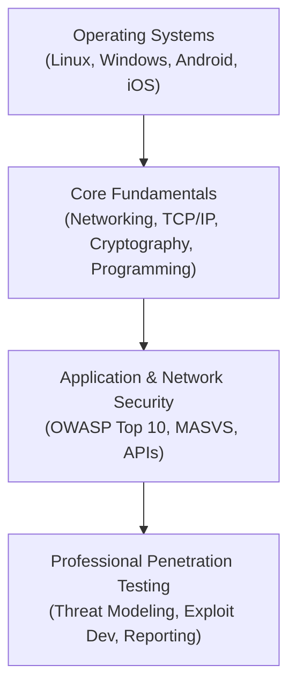
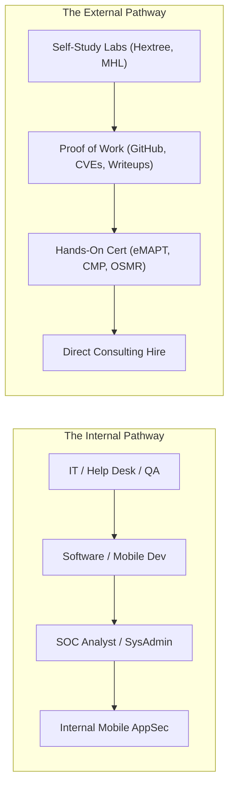

# 🎓 Becoming a Mobile Penetration Tester: Career, Consulting & Methodologies Guide

> **A real-world, battle-tested career guide for aspiring and practicing mobile penetration testers, modeled after and expanding upon the industry framework by Jack Halon ([JHalon - Becoming a Pentester](https://jhalon.github.io/becoming-a-pentester/)).**

---

## 📋 Table of Contents

- [1. The Penetration Testing Reality](#1-the-penetration-testing-reality)
  - [The "Mr. Robot" Fantasy vs Consulting Reality](#the-mr-robot-fantasy-vs-consulting-reality)
  - [Why "Security is NOT an Entry-Level Field"](#why-security-is-not-an-entry-level-field)
- [2. The Core Fundamentals: Your Non-Negotiable Foundation](#2-the-core-fundamentals-your-non-negotiable-foundation)
  - [Networking Fundamentals](#networking-fundamentals)
  - [Operating System Internals](#operating-system-internals)
  - [Programming & Scripting Proficiency](#programming--scripting-proficiency)
  - [Web Applications & Backend APIs](#web-applications--backend-apis)
  - [Active Directory & Enterprise Systems](#active-directory--enterprise-systems)
- [3. The Two Career Pathways to Mobile Pentesting](#3-the-two-career-pathways-to-mobile-pentesting)
  - [The Internal Path (Adjacent Roles to AppSec)](#the-internal-path)
  - [The External Path (Direct Consulting via "Proof of Work")](#the-external-path)
- [4. The Lifecycle of a Professional Mobile Pentest Engagement](#4-the-lifecycle-of-a-professional-mobile-pentest-engagement)
  - [Scoping & Rules of Engagement (ROE)](#scoping--rules-of-engagement-roe)
  - [Time Management (40–80 Hour Standard Engagements)](#time-management)
  - [Whitebox vs Blackbox Testing](#whitebox-vs-blackbox-testing)
  - [Professional Report Writing (Executive vs Technical)](#professional-report-writing)
  - [Client Debrief & Remediation Retesting](#client-debrief--remediation-retesting)
- [5. Building an Undeniable "Proof of Work" Portfolio](#5-building-an-undeniable-proof-of-work-portfolio)
  - [GitHub Tools & Frida Scripts](#github-tools--frida-scripts)
  - [Technical Research & Disclosures](#technical-research--disclosures)
  - [Practical Certifications](#practical-certifications)
- [6. Essential Literature & Learning Compendium](#6-essential-literature--learning-compendium)
- [7. Soft Skills, Burnout Management & Lifelong Learning](#7-soft-skills-burnout-management--lifelong-learning)

---

## 1. The Penetration Testing Reality

### The "Mr. Robot" Fantasy vs Consulting Reality

Many newcomers are drawn to penetration testing by dramatic depictions in pop culture—hooded figures typing furiously into black terminals, bypassing military firewalls in 30 seconds. 

In commercial consulting (at firms like NCC Group, Bishop Fox, Mandiant, or internal corporate red teams), the reality is structured, rigorous, and disciplined:
- **50% of your time is spent on testing**: Reverse engineering code, intercepting API traffic, writing Frida hooks, and testing business logic.
- **30% of your time is spent on report writing**: Translating complex technical bugs into actionable, risk-rated business vulnerabilities that software engineers and CISOs can understand and prioritize.
- **20% of your time is spent on scoping, kickoff meetings, and client debriefs**: Explaining findings, walking through reproduction steps, and advising on architecture remediation.

### Why "Security is NOT an Entry-Level Field"

As Jack Halon (*JHalon*) famously writes: **Security is not an entry-level field.**



You cannot meaningfully analyze, audit, or exploit an application without understanding how the underlying computer system works:
1. If you don't understand **network routing and the TLS handshake**, you cannot troubleshoot proxy interception or configure custom certificate trust stores.
2. If you don't understand **Linux UID sandboxing and file permissions**, you cannot understand why Android IPC flaws or exported Content Providers represent severe security risks.
3. If you don't understand **programming logic and memory management**, you cannot decompile Dalvik bytecode, analyze ARM assembly, or write custom Frida instrumentation hooks.

---

## 2. The Core Fundamentals: Your Non-Negotiable Foundation

Before specializing in mobile security, you must master the core technical fundamentals:

### Networking Fundamentals
- **IP Addressing & Subnetting**: IPv4, IPv6, CIDR notation (`/24`, `/16`), and subnet masks.
- **TCP/IP Stack**: Encapsulation, handshakes (SYN, SYN-ACK, ACK), packets, frames, and sockets.
- **Protocols**: DNS resolution, DHCP, HTTP/1.1 vs HTTP/2 vs HTTP/3, WebSockets, and TLS 1.2/1.3 handshakes.
- **Routing & Firewalls**: NAT, default gateways, proxy servers, packet sniffing with Wireshark and tcpdump.

### Operating System Internals
- **Linux**: File system hierarchy, process lifecycle, permissions (`chmod`, `chown`, SUID), daemons, signals, and bash scripting.
- **Android**: Linux kernel sandboxing, Binder IPC driver (`/dev/binder`), ART runtime, and AndroidManifest structure.
- **macOS / iOS (Darwin / XNU)**: Mach kernel primitives, BSD layer, Code Signing, Entitlements, and sandboxing containers.
- **Windows**: Registry, NTFS permissions, user accounts, and access control tokens.

### Programming & Scripting Proficiency
You do not need to be a software architect, but you **must** be able to read code and write custom testing scripts:
- **Python / Bash**: Rapid automation, API scripting, custom fuzzers.
- **JavaScript**: The standard language for writing **Frida** instrumentation scripts.
- **Java / Kotlin**: Required for reading decompiled Android applications in JADX.
- **Swift / Objective-C**: Required for analyzing iOS application logic and dynamic selectors.
- **ARM / ARM64 Assembly**: Fundamental for native binary reverse engineering in Ghidra or IDA Pro.

### Web Applications & Backend APIs
Every modern mobile app is an interface to a cloud backend:
- **Architecture**: RESTful APIs, GraphQL endpoints, JSON/XML data serialization, microservices.
- **Authentication**: JWTs (JSON Web Tokens), OAuth 2.0 flows, OpenID Connect, API keys, session tokens.
- **OWASP Top 10**: SQL Injection, SSRF, Cross-Site Scripting (XSS in WebViews), Broken Object Level Authorization (BOLA/IDOR).

### Active Directory & Enterprise Systems
- Enterprise mobile apps frequently interface with corporate identity providers (Microsoft Entra ID / Azure AD, Okta, PingFederate).
- Understanding Kerberos, NTLM, and OAuth federation helps when auditing enterprise mobility management (MDM/MAM) solutions.

---

## 3. The Two Career Pathways to Mobile Pentesting



### The Internal Path
1. **Start in an adjacent technical role**: Systems Administrator, QA Automation Engineer, Mobile App Developer (Android/iOS), or SOC Analyst.
2. **Apply security to your daily work**: Volunteer to review code for vulnerabilities, help implement secure certificate pinning, or configure mobile device management policies.
3. **Internal Transfer**: Pivot into your organization’s dedicated Application Security or Penetration Testing team. You bring deep institutional and architectural knowledge that outside hires lack.

### The External Path
Breaking directly into a security consultancy without traditional security job history requires demonstrable, undeniable **Proof of Work**:
- You must demonstrate that you can independently analyze an application, write exploit scripts, and articulate risks.
- Rely on public contributions: open-source tools, CVE writeups, CTF walkthroughs, and practical certifications (see Section 5).

---

## 4. The Lifecycle of a Professional Mobile Pentest Engagement

### Scoping & Rules of Engagement (ROE)
Before testing begins, define boundaries:
- **Targets**: Exact bundle IDs, package names, and backend API domains.
- **Excluded Systems**: Third-party payment gateways (Stripe, PayPal), SMS providers (Twilio), production databases.
- **Credentials & Accounts**: Test user credentials for multiple privilege tiers (e.g., standard user, tenant admin, superuser).
- **Environment**: Staging/UAT environment vs Production. (Always prefer staging with test data for destructive testing).

### Time Management (40–80 Hour Standard Engagements)
Commercial assessments typically allocate **40 hours (1 week)** for a single app or **80 hours (2 weeks)** for dual-platform (Android + iOS):
- **Day 1 (Setup & Reconnaissance)**: Install IPA/APK, bypass root/jailbreak checks, configure proxy, verify system CA trust, map API endpoints, and begin automated SAST with MobSF/apkleaks.
- **Day 2 (Static Analysis & Reverse Engineering)**: Audit decompiled Java/Smali/Swift/Mach-O code, hunt for hardcoded credentials, check IPC exposure, and inspect local storage (SQLite, SharedPreferences, Keychain).
- **Day 3 (Dynamic Analysis & Interception)**: Bypass SSL Pinning, test deep links, test WebView interfaces, write custom Frida hooks to manipulate runtime logic.
- **Day 4 (Backend API Security Testing)**: Test all intercepted endpoints for BOLA/IDOR, broken authorization, mass assignment, and business logic flaws.
- **Day 5 (Report Writing & Verification)**: Formulate reproduction steps, capture clean evidence (Burp requests/responses, Frida logs), assign CVSS scores, and draft actionable developer remediation.

### Whitebox vs Blackbox Testing
- **Blackbox**: No source code provided; only the compiled APK/IPA. You must decompile and reverse engineer the app.
- **Whitebox / Greybox**: Client provides the full source repository (Git access) alongside compiled debug builds. This is significantly more efficient because you can pair static code review with live runtime testing.

### Professional Report Writing
A penetration test report is the sole deliverable the client pays for. High-quality reports separate amateur testers from senior consultants:

```
[Finding Title]: Broken Object Level Authorization Allows Arbitrary User Profile Modification
[Severity]: High (CVSS 8.1)
[Target Component]: PUT /api/v1/users/{id}/profile (Android & iOS)

[Executive Summary]:
A business logic flaw in the user profile API endpoint allows any authenticated mobile user
to modify the profile details (including email and phone number) of any other registered user
by altering the numeric user ID in the API request.

[Technical Description & Root Cause]:
The mobile application relies on the client to supply the account ID in the request path rather
than deriving identity from the validated JWT claims. The server fails to verify whether the
calling identity matches the requested resource ID.

[Reproduction Steps]:
1. Log in to the application as User A (ID: 1042).
2. Intercept the profile update request in Burp Suite:
   PUT /api/v1/users/1042/profile HTTP/1.1
   Host: api.target.com
   Authorization: Bearer <Token_User_A>
   {"email": "attacker@exploit.com"}
3. Modify the path parameter to User B's ID (ID: 1043).
4. Send the request. Note HTTP 200 OK response.
5. Verify User B's email was changed.

[Remediation Advice]:
Enforce server-side authorization checks. Do not trust client-supplied ID parameters;
extract user identity exclusively from validated server-side session tokens or JWT subject claims.
```

---

## 5. Building an Undeniable "Proof of Work" Portfolio

If you lack formal security job experience, your portfolio is your resume:

1. **GitHub Portfolio**:
   - Write custom Frida scripts (e.g., specialized pinning bypasses, dynamic method tracers).
   - Publish plugins or automation scripts for tools like JADX, Burp Suite, or Caido.
2. **Technical Blog & Writeups**:
   - Write detailed writeups of mobile CTFs (e.g., [Mobile Hacking Lab](https://www.mobilehackinglab.com/), [AllSafe](https://github.com/t0thkr1s/allsafe), [OWASP UnCrackable](https://github.com/OWASP/mastg/tree/master/Crackmes)).
   - Document the mechanics of how you bypassed a complex security control.
3. **Responsible Disclosures & Bug Bounties**:
   - Test open-source mobile applications or participate in public bug bounty programs on HackerOne and Bugcrowd.
   - Earn Hall of Fame listings and CVE credits.
4. **Practical Certifications**:
   - Practical, exam-based certifications demonstrate hands-on ability over multiple-choice memorization.

---

## 6. Essential Literature & Learning Compendium

As curated by Jack Halon and leading mobile security practitioners:

### Books
- **The Mobile Application Hacker’s Handbook** (*Dominic Chell, Tyrone Erasmus, Shaun Colley, Ollie Whitehouse*) — The foundational text for mobile penetration testing.
- **Android Security Internals** (*Nikolay Elenkov*) — Indispensable guide to Android OS permissions, cryptographic subsystems, IPC, and package management.
- **Android Hacker’s Handbook** (*Joshua J. Drake et al.*) — In-depth guide to native exploitation, root techniques, and RIL attacks.
- **iOS Application Security** (*David Thiel*) — The definitive manual for iOS sandboxing, data protection, and Mach-O reversing.
- **iOS Hacker’s Handbook** (*Charlie Miller, Dino Dai Zovi, et al.*) — Classic binary exploitation and iOS kernel concepts.
- **The Web Application Hacker’s Handbook** (*Dafydd Stuttard & Marcus Pinto*) — Critical for understanding the backend APIs that mobile apps interact with.

### Premier Interactive Platforms & Training
- **[Hextree.io](https://hextree.io)** — The premier training platform for Android security, advanced IPC attacks, intent redirection, and bug bounty methodologies by LiveOverflow and Martin.
- **[Mobile Hacking Lab](https://www.mobilehackinglab.com/)** — Modern, hands-on vulnerable Android and iOS challenges operating on virtual and Corellium devices.
- **[OWASP Mobile Application Security (MAS)](https://mas.owasp.org/)** — MASTG (Testing Guide) and MASVS (Verification Standard).
- **[Azeria Labs](https://azeria-labs.com/)** — The industry gold standard for learning ARM assembly and binary reverse engineering.
- **[PortSwigger Web Security Academy](https://portswigger.net/web-security)** — Master API vulnerability classes (BOLA, broken auth, SSRF).

---

## 7. Soft Skills, Burnout Management & Lifelong Learning

### Soft Skills in Consulting
- **Empathy for Developers**: Developers are not your adversaries. Frame findings constructively. Recommend realistic, maintainable fixes rather than simply saying "this is broken."
- **Clear Communication**: Practice explaining a vulnerability in two ways: one for a technical lead (citing code paths and Frida snippets), and one for an executive (citing business and financial risk).

### Managing Burnout
- Security testing requires sustained, intense focus. In commercial consulting, you are constantly solving puzzles under strict deadlines.
- Set boundaries between learning at night and professional work. Take time away from screens to prevent fatigue.

### Lifelong Learning
The mobile ecosystem evolves rapidly. Every year, Apple and Google introduce new security features:
- Android 14+ immutable APEX certificate stores.
- Apple’s rootless iOS architectures and Rapid Security Responses.
- The shift from native Java/Swift to cross-platform frameworks (Flutter BoringSSL, React Native Hermes bytecode).

Stay engaged by reading security research blogs, following researchers on GitHub and Twitter/X, and participating in conferences like **DEF CON**, **Black Hat**, **BSides**, and **OWASP AppSec**.
