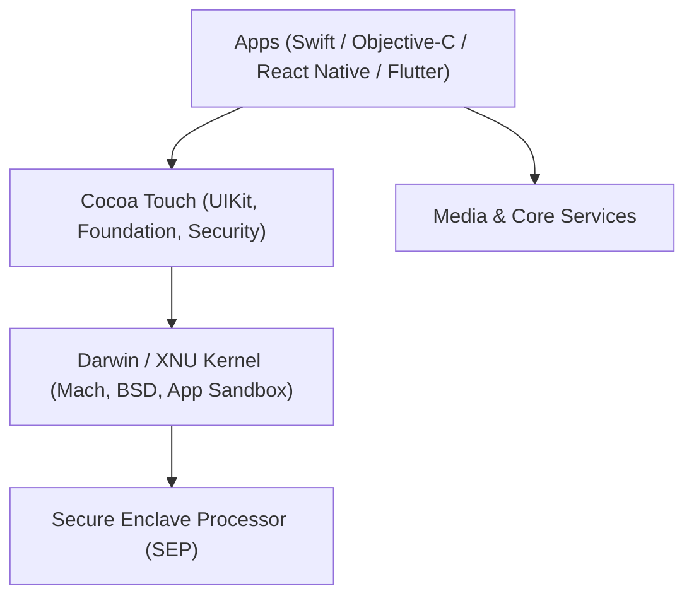

# 🍎 Comprehensive iOS Application Penetration Testing Guide

> **A complete, hands-on, beginner-to-advanced roadmap for auditing, reverse engineering, dynamically instrumenting, and exploiting iOS applications.**

---

## 📋 Table of Contents

- [1. iOS Architecture & Security Model](#1-ios-architecture--security-model)
  - [Darwin / XNU Kernel & Sandboxing](#darwin--xnu-kernel--sandboxing)
  - [Code Signing & Entitlements](#code-signing--entitlements)
  - [Secure Enclave Processor (SEP) & Keychain](#secure-enclave-processor-sep--keychain)
  - [IPA Structure & Mach-O Binary Anatomy](#ipa-structure--mach-o-binary-anatomy)
  - [Objective-C Runtime vs Swift Mechanics](#objective-c-runtime-vs-swift-mechanics)
- [2. Testing Environment & Lab Setup](#2-testing-environment--lab-setup)
  - [Physical Devices: Checkm8 vs Modern Devices](#physical-devices-checkm8-vs-modern-devices)
  - [Jailbreak Types: Checkra1n, Palera1n, Dopamine](#jailbreak-types-checkra1n-palera1n-dopamine)
  - [Non-Jailbroken Testing with TrollStore](#non-jailbroken-testing-with-trollstore)
  - [SSH Over USB & Port Forwarding](#ssh-over-usb--port-forwarding)
  - [Installing Burp / Caido CA Certificate & Full Trust](#installing-burp--caido-ca-certificate--full-trust)
  - [Essential Cydia / Sileo Tweaks](#essential-cydia--sileo-tweaks)
- [3. Static Analysis & Reverse Engineering (SAST)](#3-static-analysis--reverse-engineering-sast)
  - [Decrypting FairPlay DRM IPAs (frida-ios-dump, bagbak)](#decrypting-fairplay-drm-ipas)
  - [Mach-O Binary Auditing (otool, checksec)](#mach-o-binary-auditing)
  - [Header Extraction (class-dump, dsdump)](#header-extraction)
  - [Decompilation in Ghidra & IDA Pro (ARM64)](#decompilation-in-ghidra--ida-pro-arm64)
  - [Info.plist & ATS Security Review](#infoplist--ats-security-review)
- [4. Dynamic Analysis & Runtime Instrumentation (DAST)](#4-dynamic-analysis--runtime-instrumentation-dast)
  - [Dynamic Instrumentation with Frida (ObjC & Swift)](#dynamic-instrumentation-with-frida)
  - [Runtime Exploration with Objection](#runtime-exploration-with-objection)
  - [Bypassing SSL/TLS Pinning (TrustKit, AFNetworking)](#bypassing-ssltls-pinning)
  - [Jailbreak Detection Evasion](#jailbreak-detection-evasion)
- [5. Vulnerability Deep-Dives & Attack Scenarios](#5-vulnerability-deep-dives--attack-scenarios)
  - [Insecure Keychain Storage & Protection Classes](#insecure-keychain-storage--protection-classes)
  - [Custom URL Schemes & Universal Links Hijacking](#custom-url-schemes--universal-links-hijacking)
  - [Pasteboard Sniffing & Background App Snapshots](#pasteboard-sniffing--background-app-snapshots)
  - [Insecure Local Storage (UserDefaults, Plists, CoreData)](#insecure-local-storage)
  - [Mobile API Security for iOS Backends](#mobile-api-security-for-ios-backends)
- [6. Practical Vulnerable Labs & Targets](#6-practical-vulnerable-labs--targets)
- [7. iOS Security Tools Matrix](#7-ios-security-tools-matrix)
- [8. Step-by-Step iOS Pentest Checklist](#8-step-by-step-ios-pentest-checklist)

---

## 1. iOS Architecture & Security Model



### Darwin / XNU Kernel & Sandboxing
- **Darwin Kernel**: Hybrid kernel composed of Mach (IPC, threads, tasks) and BSD (POSIX APIs, networking, user credentials).
- **App Sandboxing**: Every third-party app runs inside an isolated container directory:
  - Bundle Container: `/var/containers/Bundle/Application/<UUID>/` (Read-only app bundle, Mach-O executable).
  - Data Container: `/var/mobile/Containers/Data/Application/<UUID>/` (Documents, Library, tmp, Caches).
  - Apps cannot read or write outside their container without Apple entitlements.

### Code Signing & Entitlements
- Every executable binary, framework, and `.dylib` must be signed by an Apple-approved certificate.
- **Entitlements**: XML key-value pairs baked into the binary signature specifying privileged capabilities (e.g., iCloud access, Push Notifications, Keychain sharing groups).

### Secure Enclave Processor (SEP) & Keychain
- **SEP**: Hardware-isolated security coprocessor that generates and stores cryptographic keys. Hardware keys never leave the SEP; cryptographic operations (e.g., biometric verification via Face ID / Touch ID) happen on the chip.
- **iOS Keychain**: SQLite database located at `/var/Keychains/keychain-2.db`, encrypted with a hardware key derived from the user's passcode and the device UID.
  - Protection attributes control when items are accessible:
    - `kSecAttrAccessibleWhenUnlocked` (Recommended default).
    - `kSecAttrAccessibleAfterFirstUnlock`.
    - `kSecAttrAccessibleAlways` (**Vulnerable / Deprecated**: Accessible even when device is locked).
    - `ThisDeviceOnly` flag: Prevents the secret from migrating to iCloud backups or new devices.

### IPA Structure & Mach-O Binary Anatomy
An `.ipa` file is a zip archive containing:
```
Payload/<AppName>.app/
├── Info.plist                     # Application configuration metadata
├── <AppName>                      # The Mach-O ARM64 executable binary
├── Frameworks/                    # Embedded dynamic frameworks (.dylib)
├── embedded.mobileprovision       # Provisioning profile and entitlements
├── Base.lproj/                    # Storyboards and nib files
└── _CodeSignature/                # Code signature directory
```

- **Mach-O Header**:
  - `Header`: CPU architecture (ARM64), file type (`MH_EXECUTE`).
  - `Load Commands`: Defines segment layout (`__TEXT` code segment, `__DATA` read/write variables, `__LINKEDIT` symbol table).
  - `Segments & Sections`: `__text` (machine code), `__cstring` (string constants), `__objc_methname` (Objective-C method names).

### Objective-C Runtime vs Swift Mechanics
- **Objective-C**: Uses dynamic message passing (`objc_msgSend(receiver, selector, ...)`). Method names and classes are preserved in cleartext inside the binary, making runtime interception trivial.
- **Swift**: Uses static and vtable dispatch for performance, but methods exposed to Objective-C (`@objc`) or dynamic frameworks remain hookable. Swift method names undergo **name mangling** (e.g., `$s7TargetApp12LoginManagerc10doLogin...`), which can be demangled using `swift-demangle`.

---

## 2. Testing Environment & Lab Setup

### Physical Devices: Checkm8 vs Modern Devices
- **Hardware Exploit Devices (Best for Research)**:
  - iPhone X, iPhone 8, iPhone 7, iPad (A11 and older chips).
  - Immune to software patches due to the **Checkm8 BootROM exploit**. Can be jailbroken on any compatible iOS version using **checkra1n** or **palera1n**.
- **Modern Devices (iOS 15.0 – 16.6.1)**:
  - Can be jailbroken using semi-untethered solutions like **Dopamine** (rootless jailbreak).

### Jailbreak Types
- **Rootful**: Modifies the root system partition (`/`). Legacy method, breaks on modern iOS due to Sealed System Volume (SSV).
- **Rootless (Modern Standard)**: Leaves system volume untouched. Stores binaries and tweaks inside `/var/jb/` to avoid triggering root checks and SSV panics.

### Non-Jailbroken Testing with TrollStore
- **TrollStore**: A permanent app installer exploiting CoreTrust bugs (iOS 14.0 – 16.6.1).
- Allows installing unsigned IPAs with arbitrary entitlements without requiring a jailbreak or renewing 7-day developer certificates.

### SSH Over USB & Port Forwarding
```bash
# Install libimobiledevice / usbmuxd
# Forward local port 2222 to device port 22 over lightning/USB cable:
iproxy 2222 22

# SSH into the iOS device (Default password is "alpine"):
ssh -p 2222 root@localhost

# Immediately change default passwords for security:
passwd root
passwd mobile
```

### Installing Burp / Caido CA Certificate & Full Trust
1. On your iOS device, open Safari and navigate to `http://burpsuite` to download `cacert.der`.
2. Go to **Settings -> Profile Downloaded -> Install**.
3. **Critical Step**: Enable full SSL trust:
   - Go to **Settings -> General -> About -> Certificate Trust Settings**.
   - Toggle **Enable Full Trust for Root Certificates** on the PortSwigger CA.

### Essential Cydia / Sileo Tweaks
- **Frida**: Install `frida-server` from repo `https://build.frida.re`.
- **SSL Kill Switch 2 / 3**: Hooks low-level TLS handshake APIs (`SecureTransport`) to disable SSL Pinning system-wide.
- **Shadow** & **Choicy**: Modern rootless-compatible tweaks to selectively disable tweak injection and bypass jailbreak detections.

---

## 3. Static Analysis & Reverse Engineering (SAST)

### Decrypting FairPlay DRM IPAs

App Store IPAs are encrypted with Apple's FairPlay DRM. You cannot decompile them without decrypting them first from memory on a jailbroken device:

#### Method 1: Using `frida-ios-dump`
```bash
# Clone tool
git clone https://github.com/AloneMonkey/frida-ios-dump.git
cd frida-ios-dump && pip install -r requirements.txt

# Forward SSH port
iproxy 2222 22 &

# Dump and decrypt running app to a local decrypted IPA
python dump.py com.target.app -o Decrypted_App.ipa
```

#### Method 2: Using `bagbak`
```bash
# Automated Node.js-based one-click decryptor
npm install -g bagbak
bagbak com.target.app
```

---

### Mach-O Binary Auditing

Inspect compiler security mitigations:
```bash
# Check compiler protections
otool -hv target_binary

# Or use checksec
checksec --file=target_binary
```
Verify the following flags:
- **PIE (Position Independent Executable)**: Randomizes base address via ASLR.
- **Stack Canaries**: Protects against buffer overflows (`__stack_chk_fail`).
- **ARC (Automatic Reference Counting)**: Mitigates use-after-free and memory corruption.

---

### Header Extraction
```bash
# Extract Objective-C class interfaces and method signatures
class-dump DecryptedBinary -o Headers/

# For modern Swift + Objective-C binaries:
dsdump --swift DecryptedBinary
```

---

### Decompilation in Ghidra & IDA Pro (ARM64)
- Open the decrypted binary in **Ghidra** or **IDA Pro** and select `ARM:64:v8A:default`.
- Locate functions using Objective-C method names (e.g., `-[AuthService authenticateUser:withPassword:]`).
- Search for strings (`Window -> Defined Strings` in Ghidra) to locate hardcoded endpoints, encryption keys, and internal URLs.

---

### Info.plist & ATS Security Review
Inspect `Payload/<App>.app/Info.plist`:
- **App Transport Security (ATS)**:
  ```xml
  <key>NSAppTransportSecurity</key>
  <dict>
      <key>NSAllowsArbitraryLoads</key>
      <true/> <!-- VULNERABLE: Disables HTTPS enforcement system-wide -->
  </dict>
  ```
- **Custom URL Schemes**:
  ```xml
  <key>CFBundleURLTypes</key>
  <array>
      <dict>
          <key>CFBundleURLSchemes</key>
          <array>
              <string>mybankingapp</string>
          </array>
      </dict>
  </array>
  ```

---

## 4. Dynamic Analysis & Runtime Instrumentation (DAST)

### Dynamic Instrumentation with Frida

Frida hooks Objective-C runtime selectors and native ARM64 functions.

#### Hooking an Objective-C Method (`hook_ios.js`):
```javascript
if (ObjC.available) {
    console.log("[*] Objective-C runtime available. Injecting hooks...");

    // Hook a class method
    var hook = ObjC.classes.SecurityChecker["- isDeviceJailbroken"];
    Interceptor.attach(hook.implementation, {
        onLeave: function (retval) {
            console.log("[+] Original isDeviceJailbroken returned: " + retval);
            retval.replace(0x0); // Force return NO (false)
            console.log("[+] Overwrote return value to: 0 (Safe)");
        }
    });

    // Intercept method arguments
    var authHook = ObjC.classes.AuthManager["- loginUser:password:"];
    Interceptor.attach(authHook.implementation, {
        onEnter: function (args) {
            var user = new ObjC.Object(args[2]); // args[0]=self, args[1]=selector, args[2]=arg1
            var pass = new ObjC.Object(args[3]);
            console.log("[*] Intercepted Login -> User: " + user.toString() + " | Password: " + pass.toString());
        }
    });
}
```

Spawn and run:
```bash
frida -U -f com.target.app -l hook_ios.js --no-pause
```

---

### Runtime Exploration with Objection

```bash
# Attach to app
objection -g "TargetApp" explore

# Common iOS Commands:
ios jailbreak disable                   # Attempt jailbreak bypass
ios sslpinning disable                  # Attempt SSL Pinning bypass
ios keychain dump                       # Dump decrypted Keychain entries to screen
ios ui biometrics_bypass                # Force biometric authentication success
ios nsuserdefaults get                  # Dump contents of UserDefaults plist
ios hooking list classes                # List all loaded Objective-C classes
ios hooking search methods Auth         # Search for classes with Auth in name
```

---

### Bypassing SSL/TLS Pinning

1. **Objection**:
   ```bash
   ios sslpinning disable
   ```
2. **Frida CodeShare**:
   ```bash
   frida -U -f com.target.app --codeshare sowdust/universal-ios-ssl-pinning-bypass --no-pause
   ```
3. **SSL Kill Switch 2 / 3**: A substrate tweak that hooks `SSLHandshake` and `nw_tls_create_peer_authenticator` to permanently accept any certificate.

---

### Jailbreak Detection Evasion
Common iOS jailbreak checks look for:
1. Presence of Cydia / Sileo files: `/Applications/Cydia.app`, `/var/jb/`, `/bin/bash`.
2. Calling `fork()` (restricted by the sandbox on non-jailbroken devices).
3. Writing files outside the sandbox: Attempting to write to `/private/test.txt`.

**Evasion Techniques**: Use **Shadow** tweak (rootless compatible) or use Frida to hook `access()`, `stat()`, and `fork()`.

---

## 5. Vulnerability Deep-Dives & Attack Scenarios

### Insecure Keychain Storage & Protection Classes
- **Vulnerability**: Storing tokens or cryptographic keys with weak attributes like `kSecAttrAccessibleAlways` or `kSecAttrAccessibleAfterFirstUnlockThisDeviceOnly: false`.
- **Exploitation**: Dump the keychain via Objection (`ios keychain dump`) or [`keychain-dumper`](https://github.com/ptoomey3/Keychain-Dumper).

### Custom URL Schemes & Universal Links Hijacking
- Custom URL schemes (`myapp://action?token=xyz`) do not guarantee uniqueness. Any rogue application installed on the device can register the identical scheme and hijack calls.
- **Test with Safari**:
  Open Safari and type `myapp://transfer?to=attacker&amount=1000`. Does the app execute the transfer without re-authenticating the user?

### Pasteboard Sniffing & Background App Snapshots
- **Pasteboard (`UIPasteboard`)**: Any application running on iOS can read the general clipboard without prompting the user on older iOS versions.
- **Snapshot Leaks**: When an app enters the background, iOS captures a screenshot of the current screen and stores it in `/Library/Caches/Snapshots/`. If sensitive data (credit cards, medical data) is displayed, verify that the application blanks or blurs the view in `applicationDidEnterBackground:`.

### Insecure Local Storage
Inspect `/var/mobile/Containers/Data/Application/<UUID>/`:
- `Library/Preferences/<bundle_id>.plist`: Defaults stored via `UserDefaults` are unencrypted cleartext XML files.
- `Documents/*.sqlite`: Check SQLite databases using `sqlite3`. Verify whether database files are encrypted with SQLCipher.

### Mobile API Security for iOS Backends
- Inspect API traffic for:
  - **BOLA / IDOR**: Insecure resource identifiers in REST/GraphQL requests.
  - **Weak Authorization**: Replaying tokens across privilege levels.
  - **Token Storage**: Ensure refresh tokens are in the Keychain and not saved in `UserDefaults`.

---

## 6. Practical Vulnerable Labs & Targets

1. **[Mobile Hacking Lab iOS](https://www.mobilehackinglab.com/)** — Modern vulnerable iOS challenges and Corellium-based virtual testing.
2. **[DVIA-v2 (Damn Vulnerable iOS App)](https://github.com/prateek147/DVIA-v2)** — Comprehensive Swift-based vulnerable iOS app covering anti-tampering, keychain security, network interception, and runtime manipulation.
3. **[OWASP iGoat-Swift](https://github.com/OWASP/iGoat-Swift)** — Official OWASP iOS learning application.
4. **[OWASP UnCrackable iOS Apps](https://github.com/OWASP/mastg/tree/master/Crackmes)** — Official reverse engineering challenges (Levels 1–2).
5. **[Crackmes.one](https://crackmes.one/)** — Filter by "iOS" / "ARM64" for binary reversing wargames.

---

## 7. iOS Security Tools Matrix

| Tool | Purpose | Link |
| :--- | :--- | :--- |
| **Frida** | Dynamic instrumentation for apps and processes | [Website](https://frida.re/) |
| **Objection** | Runtime exploration toolkit powered by Frida | [GitHub](https://github.com/sensepost/objection) |
| **frida-ios-dump** | Pull decrypted App Store IPAs via Frida | [GitHub](https://github.com/AloneMonkey/frida-ios-dump) |
| **bagbak** | Automated one-click iOS app decryptor | [GitHub](https://github.com/ChiChou/bagbak) |
| **Ghidra** | Open-source SRE framework for Mach-O binaries | [Website](https://ghidra-sre.org/) |
| **class-dump** | Command-line tool to dump Objective-C headers | [GitHub](https://github.com/nygard/class-dump) |
| **dsdump** | Enhanced Swift and Objective-C class dumper | [GitHub](https://github.com/DerekSelander/dsdump) |
| **Burp Suite** | Interception proxy for mobile web and API traffic | [PortSwigger](https://portswigger.net/burp) |
| **Caido** | Lightweight, modern security proxy | [Website](https://caido.io/) |
| **TrollStore** | Permanent IPA installer for iOS 14.0–16.6.1 | [GitHub](https://github.com/opa334/TrollStore) |

---

## 8. Step-by-Step iOS Pentest Checklist

- [ ] **1. Scoping & Environment**:
  - [ ] Obtain decrypted IPA or install app from App Store on jailbroken device.
  - [ ] Dump decrypted IPA using `bagbak` or `frida-ios-dump`.
  - [ ] Install Burp Suite CA and enable Full Trust in iOS Certificate Trust Settings.
- [ ] **2. Static Analysis**:
  - [ ] Unzip decrypted IPA and inspect `Info.plist` (ATS rules, URL schemes).
  - [ ] Run `class-dump` or `dsdump` to extract Objective-C / Swift headers.
  - [ ] Analyze the Mach-O binary in Ghidra for hardcoded secrets, endpoints, and cryptosystems.
  - [ ] Check binary flags (`checksec --file=Binary` for PIE, ARC, Canaries).
- [ ] **3. Dynamic Interception**:
  - [ ] Configure Wi-Fi HTTP proxy.
  - [ ] Bypass SSL Pinning with Objection or Frida scripts.
- [ ] **4. Runtime Manipulation**:
  - [ ] Bypass Jailbreak detection using Objection or custom Frida hooks.
  - [ ] Bypass biometric authentication (`ios ui biometrics_bypass`).
- [ ] **5. Data Storage & Privacy Audit**:
  - [ ] Dump Keychain (`ios keychain dump`) and inspect accessibility flags.
  - [ ] Inspect `Library/Preferences/` (`UserDefaults`) and SQLite databases.
  - [ ] Check `/Library/Caches/Snapshots/` for unblurred screenshots.
- [ ] **6. Backend & API Auditing**:
  - [ ] Test mobile endpoints for BOLA/IDOR, broken authentication, and business logic flaws.
- [ ] **7. Reporting**:
  - [ ] Provide clear PoC with Frida scripts, objection logs, and developer remediation.
